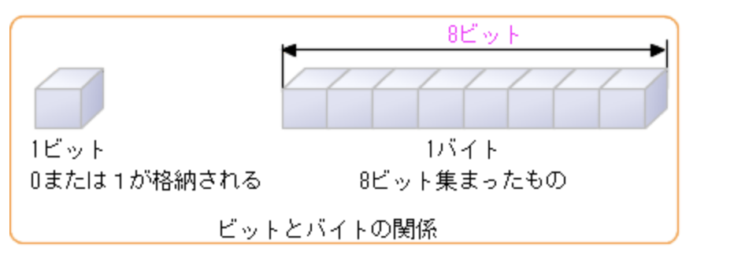
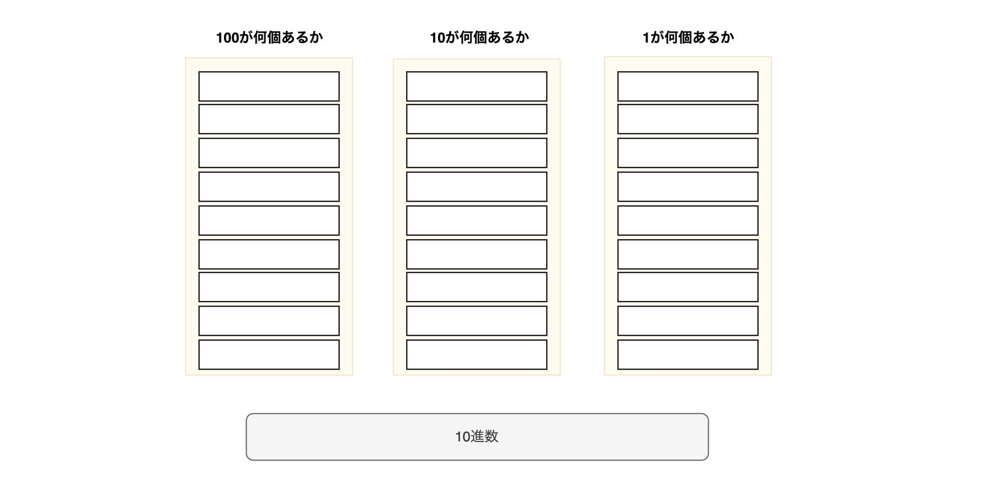
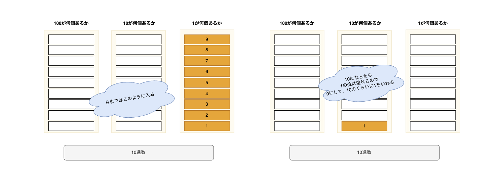
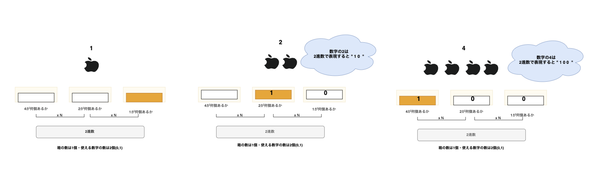
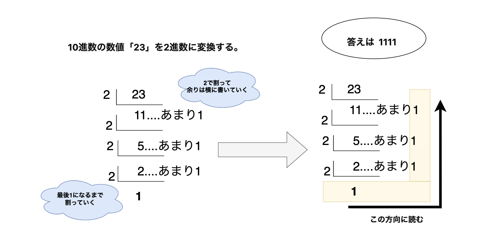
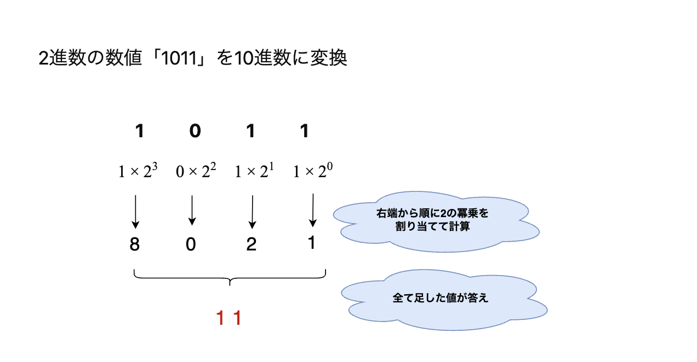

# コンピュータの基本単位: ビットとバイト/進数表現

> 参考資料
>
> - [Udemy: コンピュータの世界](https://www.udemy.com/course/lerning-fe/learn/lecture/22742299#overview)
> - [Udemy: 進数とは](https://www.udemy.com/course/lerning-fe/learn/lecture/22742305#overview)
>

[My draw.io](https://app.diagrams.net/#G1QrKo2enBJ2b2YYSgMR80dZk0MKe1HU1z#%7B%22pageId%22%3A%22HV1P_B6KKjzx8KmIfiRH%22%7D)

## bit: ビット

- **コンピュータの最小単位**.
  - 情報の単一のデジタル値を表す。
    > 情報を表すために使用されるデジタル形式の中で、1つの単位で表される値のこと
  - 1bit= 0と1が格納でき、このうち一つが格納される。

*[基本情報講座から画像拝借](http://www.it-license.com/bit_byte/)*

## byte: バイト

- 8ビットの固定長のデータ単位。 
   = **8ビット=1バイト**

> ### ビットとバイトまとめ
>
> - **1bit: コンピュータの最小単位で1か0かを示す箱のこと**
> - **8bitで1byteとする**

## 進数表現について

- 情報を表現するために2進数（バイナリ）と10進数（デシマル）や、8進数（オクタル）、16進数ヘキサデシマル）がよく使われる。

#### 10進数で説明すると

10進数(0~9)

- 10進数であれば、箱の大きさは９箱。
- 扱える数字は10個(0~9)だ。

- 1-9までは1のくらいが溢れないので入れれる。
- 10まで行ったら入らなくなるので、10のくらいに1を足す。そして1のくらいは0になる。

というふうに計算できる。

### N進数...いくつで桁が変わるのか？

同様に他の進数表現もできる。

**N進数　=　箱の大きさはN-1個・使う数字の数はN個**

ということになる。

> ex. 2進数だったら... 
> 2進数 = 箱の大きさは1個、使う数字の数は2個(0,1) 
> 8進数 = 箱の大きさは7個、使う数字の数は8個(0~7)
>

## 2進数だと

## 10進数を2進数に変換

### 方法1. 割り算で求める

10進数の23を2進数に変換

答えは "1111"

## 2進数から10進数に変換

2進数の1011を10進数に変換しよう

1. 2進数の各桁に対して、2のべき乗を割り当てて計算する
2. すべて足した値が答え

答えは　**11**
