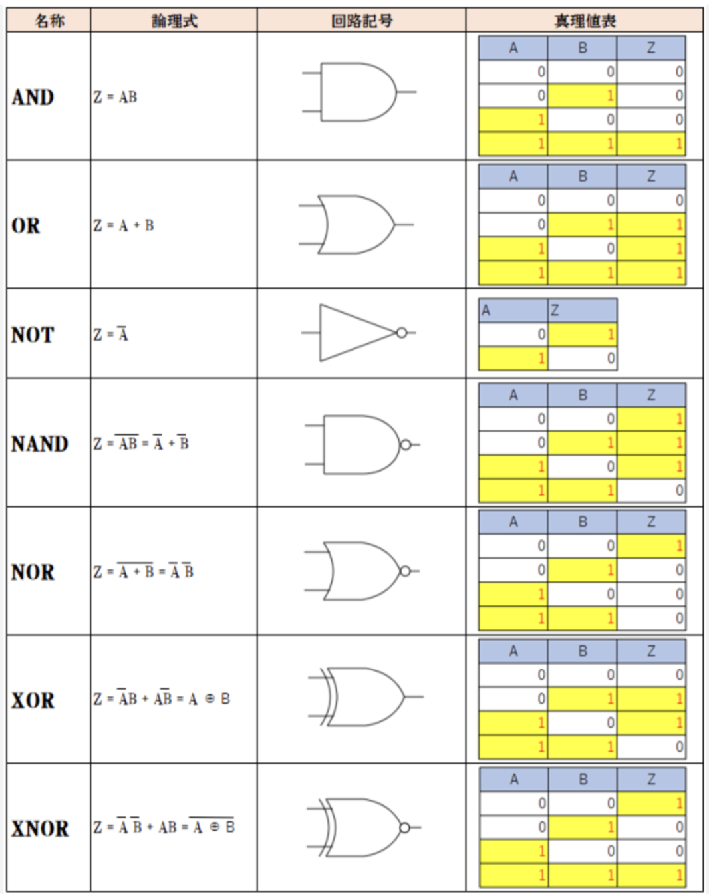

# 論理演算と論理回路について

## 論理回路図表

> [【論理演算】論理回路の考え方や解き方、覚え方について図解を用いてわかりやすく解説](https://pyming.info/2021/07/24/ronri_kairo/)  より図を拝借です
>

- **⚪︎がついてるものは否定すれば良い。"真理値表を反転する"と良い。** 
→ "0 / 0"の時は1になるし、"1 / 1"ならば "0" 
→ どちらかが1ならば1のまま。

| 種類 | 説明 |
|---|---|
| AND（論理積）|どちらの入力も1であれば1.  そうでなければ0|
| NAND（論理積の否定）|論理積の出力を逆にする |
| OR（論理和） |どちらかが1であれば1. 両方0の場合のみ0|
| NOR（論理和の否定）| |
| NOT（論理否定） |2つの入力に対してではなく,一つのものを逆のものに変える|
