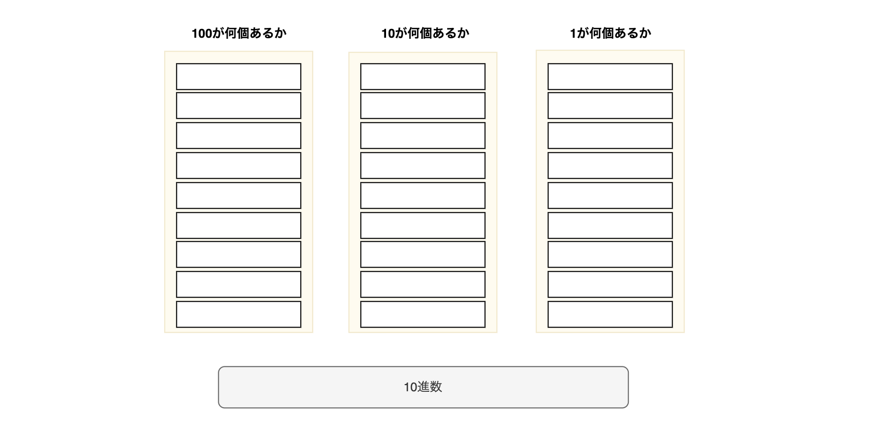
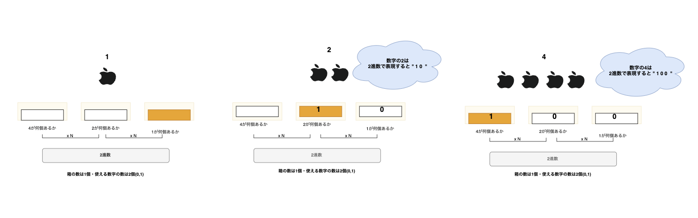
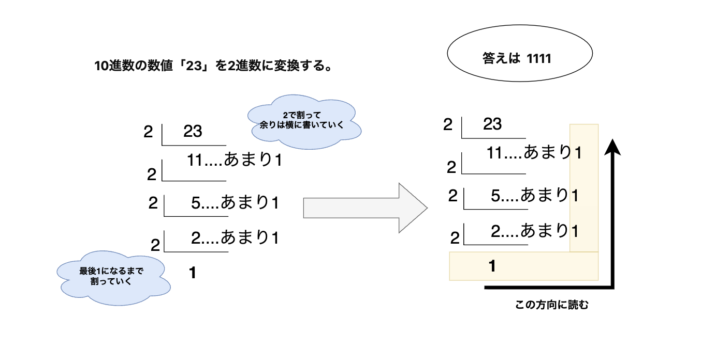
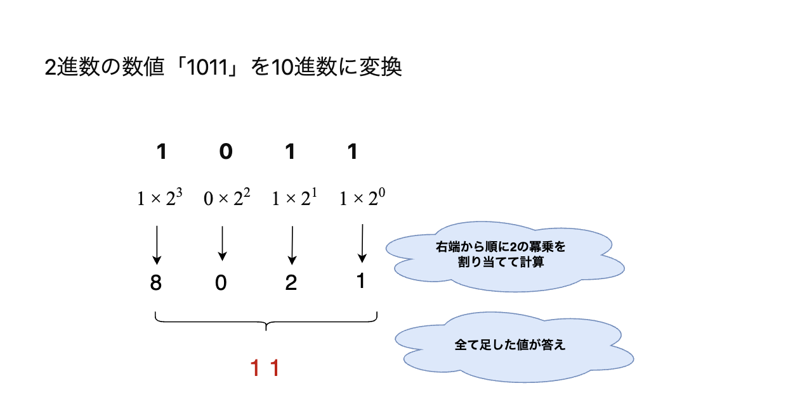

# 進数表現について

- 情報を表現するために2進数（バイナリ）と10進数（デシマル）や、8進数（オクタル）、16進数ヘキサデシマル）がよく使われる。

## 進数とは...10進数で説明すると

10進数(0~9)

- 10進数であれば、箱の大きさは９箱。
- 扱える数字は10個(0~9)だ。

- 1-9までは1のくらいが溢れないので入れれる。
- 10まで行ったら入らなくなるので、10のくらいに1を足す。そして1のくらいは0になる。

というふうに計算できる。

### N進数...いくつで桁が変わるのか？

同様に他の進数表現もできる。

**N進数　=　箱の大きさはN-1個・使う数字の数はN個**

ということになる。

> ex. 2進数だったら... 
> 2進数 = 箱の大きさは1個、使う数字の数は2個(0,1) 
> 8進数 = 箱の大きさは7個、使う数字の数は8個(0~7)
>

## 2進数だと

## 10進数を2進数に変換

### 方法1. 割り算で求める

10進数の23を2進数に変換

答えは "1111"

## 2進数から10進数に変換

2進数の1011を10進数に変換しよう

1. 2進数の各桁に対して、2のべき乗を割り当てて計算する
2. すべて足した値が答え

答えは　**11**

## 2進数の計算

### 加算（足し算）

1. 各桁の対応する数字を足し合わせる。右端から順に計算。
2. 各桁の足し算を行い、桁上がりがあれば次の桁に繰り上げ。

  
### 補数表現

補数とは:

- 足すと1桁増える最も小さい値のこと。 
→ ex. 10進数の9の補数は? → 1

- では2進数の場合は?
  - 2進数でも同じく、足すと1桁増える最も小さい数のこと。 
  → 2進数の"1"の補数は? → 1
  → 2進数の"10"の補数は? → 10

#### 2の補数の簡単な求め方

1. 0と1を逆転する
2. 1をプラスする

わかりやすい動画

<https://www.youtube.com/watch?v=mHruautofhY>

> **これを他のわかりやすい例えにすると...** 
> **2進数の基本原理は1+1=2ではなく10**。 
これは2進数に2という概念がないため。そのため2になると桁が1つ上がり10となる。 
これを逆に考えると1+1=10なので、10-1=1
