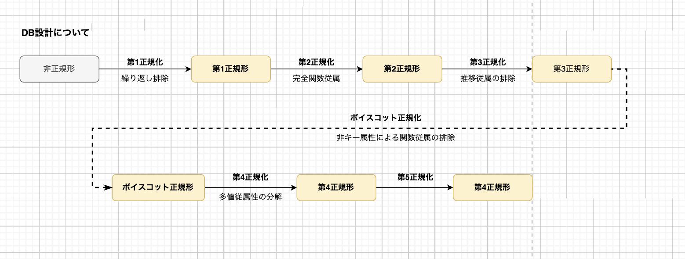

# DBの基礎

## スキーマ

- DBの仕様や構造を定義するもの
- 標準的には3層スキーマが使用される
  - 外部スキーマ：どんなふうにData表示するのか
  - 内部スキーマ：ハードウェアにどう保存するか
  - 概念スキーマ: データの関連性について

## ACID原則(アコイド原則)

トランザクション処理には、**4つの特性(求められる性質) "ACID"** がある.(特にAとIは大事)

> トランザクション 
> 関連する複数の処理を一つの処理として実行・管理する仕組み。 
> 簡単に言えば、**ひとまとまりの処理のこと**

| 特性     | 説明                                         |
|----------|----------------------------------------------|
| **`Atomicity`: 原子性**   | すべての操作が完全に実行されるか、一切実行されないかのどちらかであることを保証する。   |
| **`Consistency`: 一貫性**   | トランザクションの実行前後でデータベースの整合性が保たれること。         |
| **`Isolation`: 独立性,分離性**   | 同時に実行されても、トランザクションは互いに影響を及ぼさないこと。     |
| **`Durability`: 耐久性**   | トランザクションが完了した後も、変更は永続的で失われないこと。         |

## DB設計について

## 正規化

- **正規化：DBの一貫性をあ持つために必要な処理**
  - 目的は、**データに矛盾や重複を生じさせない**こと
  - 正規化された表のことを正規形と呼ぶ

### ▶︎ 正規化の段階　(関数従属、部分関数従属)

> - [IT用語辞典](https://e-words.jp/w/%E7%AC%AC1%E6%AD%A3%E8%A6%8F%E5%BD%A2.html)
>

- **関係従属** (functional dependency)とは： 
**リレーショナルデータベース（RDB）の表で、
2つの属性の間で片方の値を決定すると、もう一方の値が一意に決まるという性質** のこと。

- 部分関数従属とは:  
リレーショナルデータベース（RDB）の表で、 
ある属性が複数の候補キーのいずれかに関数従属している状態のこと。

## 排他制御

### 楽観ロック (Optimistic Locking): 共有ロック

**データそのものに対してロックは行わずに、
更新対象のデータが、データ取得時と同じ状態であることを確認してから更新**することで、
データの整合性を保証する手法。

### 悲観ロック (Pessimistic Locking)：専有ロック

更新対象のデータを取得する際に(selectの時点で)ロックをかけることことで、
他のトランザクションから更新されないようにする手法。

`select ... for update;`

### デットロック

> 二つのトランザクションが二つ以上の資源の確保をめぐって互いに相手を待つ状態となり，そこから先へ処理が進まなくなること. 
>
> 排他制御によりロックされた資源に他のユーザからアクセス要求が出された時、両者は互いに使用中の資源が解放されるのをブロック状態で待つという状況が発生することがある。2つ以上のユーザ間で生じるが、この状態ではどのユーザも資源の解放を待ったまま処理が進まずに停止状態となる。 このような状態をデッドロックという。

簡単に言えば、**２つ以上のトランザクションが２つ以上の資源をめぐって、
お互いがロック解除待ち状態となり誰も処理が進まなくなること**。

> **補足：なぜ"資源"という表現がされるのか**
"ロックかける粒度はシステムによって違う"から、一概にレコードということはできないから。

## 障害管理

| 用語  | 意味 |
| --- | --- |
|コミット | トランザクションで実行された操作を確定し、データベースに永続化すること|
|ロールバック| トランザクション内で実行された操作を取り消し、トランザクションを元の状態に戻すこと|
|ロールフォワード |バックアップから復元されたデータベースを、最新のトランザクションログを適用して最新の状態に更新すること|
|ウォームスタート| 再起動時にある程度の初期化処理が実行された状態から再開すること|
|コールドスタート| 再起動時に全ての初期化処理が再度実行される状態から再開すること|
|ジャーナルファイル |トランザクションの実行履歴や変更履歴を記録するためのファイル|
|レプリケーション |データベースの内容を別のデータベースにコピーし、同じデータを複数の場所に複製するプロセス|
